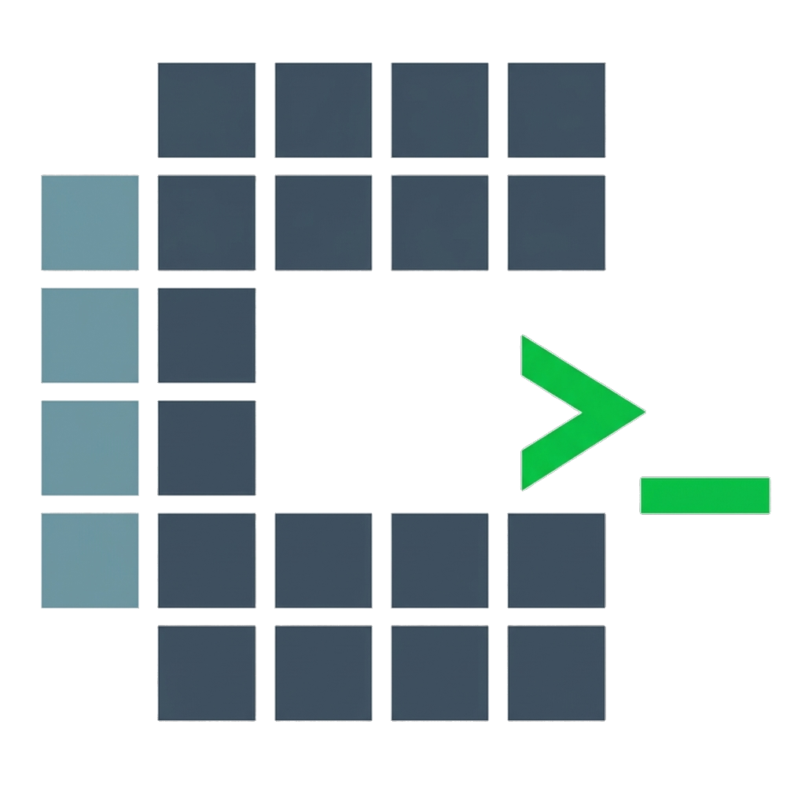

  

  <h1 align="center">CtxRun</h1>

  

    <strong>Run with context, AI at your fingertips.</strong>
     
    为开发者打造的 AI 辅助生产力工具：上下文组装 · 提示词管理 · 全局 AI 对话 · 代码对比
  

  

    
    
    
    
    
  

 

**CtxRun** 是一款专为开发者打造的 AI 辅助生产力工具。它集成了代码上下文组装、代码对比、提示词管理以及一个随时待命的全局 AI 终端，旨在无缝连接你的 IDE 与大语言模型（LLM）。

> **[English Version](./README.md)**

## ✨ 核心功能 (Core Features)

*   **🚀 Context Forge (文件整合)**: 智能地将你的项目文件打包成 LLM 易于理解的格式，支持自动移除注释、过滤二进制文件，并实时预估 Token 消耗。支持配置自动保存和项目记忆。
*   **💡 Spotlight (全局 AI 终端)**: 通过全局快捷键 (`Alt+S`) 随时唤出。在任何应用中快速搜索和执行命令，或与 AI 进行流式对话。
    *   **计算器**: 输入 `=1+1`、`=sin(pi)` 快速计算数学表达式
    *   **Shell 命令**: 输入 `>ls`、`>dir` 直接执行终端命令
    *   **范围搜索**: `/app` 搜索应用、`/cmd` 搜索命令、`/pmt` 搜索提示词
    *   **模板 AI**: 配置提示词为聊天模板，AI 对话时自动应用
    *   **应用启动**: 快速搜索并打开已安装的应用程序
*   **📚 Prompt Verse (提示词库)**: 高效管理你的常用指令和 AI 提示词。支持创建变量模板、分组管理，并可从官方库下载离线指令包。支持可执行命令和聊天模板配置。
*   **🔄 Patch Weaver (AI 补全器 & Git 对比)**: 应用 AI 生成的代码补丁，通过智能模糊匹配精确定位修改。同时也是一个强大的 Git Diff 可视化工具，支持 Working Directory 对比、版本对比和多样化导出。
*   **🛡️ 隐私安全扫描**: 内置敏感信息检测引擎，支持白名单管理，防止 API 密钥等机密信息泄露。
*   **📋 Refinery (剪贴板历史)**: 全面的剪贴板历史管理器，支持文本和图片。具备搜索/筛选、收藏重要条目、添加笔记、自动清理、日历视图以及 Spotlight 快捷粘贴集成。
*   **🖱️ Automator (工作流自动化)**: 可视化工作流自动化系统，支持节点图编排和条件分支执行。集成浏览器自动化（headless_chrome）、键盘输入模拟、鼠标操作、颜色检测、循环控制等动作。支持通过 Windows UIAutomation API 进行语义化 UI 元素定位，支持物理输入降级兜底。
*   **⛏️ Model Miner (网页内容挖掘)**: 智能网页爬虫，使用 Readability.js 提取页面核心内容，自动转换为 Markdown，支持多线程并发爬取、深度/页数限制和层次化文件存储。
*   **📡 Transfer (局域网传输)**: 局域网文件传输和即时聊天。启动本地 HTTP 服务，其他设备扫码即可连接，支持文件传输进度追踪和文本聊天。
*   **🛡️ Guard (空闲守护)**: 空闲超时自动锁屏，Windows 低级钩子全局拦截输入，长按 1.5s 圆形进度条解锁，支持防止系统休眠。
*   **🤖 Agent Tool Runtime (AI 工具运行时)**: AI 对话中可调用工具（文件系统操作、Web 搜索、内容提取），支持沙箱安全策略和审批机制。
*   **🔒 Exec Runtime (命令执行运行时)**: 安全的命令执行沙箱，支持审批、终止、终端交互。
*   **👁️ Peek (独立预览)**: 弹出式文件预览窗口，支持 DOCX/PDF/HTML/Markdown 等多格式。
*   **📡 网络测速**: 集成 M-Lab NDT7 网络速度测试。
*   **📊 系统监控增强**: 电池信息、磁盘详情、网络流量、端口进程监控。

> ### 🚀 想要了解如何使用？(Want to learn how to use it?)
>
> 👉 **[查看详细使用指南 (Check out the Detailed Usage Guide)](./USAGE.md)**

## 🛠️ 技术栈 (Tech Stack)

本项目采用现代化的**高性能桌面应用架构**构建，兼顾了极小的资源占用与流畅的用户体验，整体大小为10MB左右，运行内存占用约30MB：

*   **Core**: [Tauri 2](https://tauri.app/) (Rust + WebView2) - 提供原生级的性能与超小的安装包体积，支持多窗口。
*   **Frontend**: React 19 + TypeScript + Vite 7 - 现代化的前端开发体验。
*   **State Management**: Zustand 5 - 轻量且强大的状态管理。
*   **Internationalization**: i18next + react-i18next - 基于 JSON 的多语言支持。
*   **Styling**: Tailwind CSS + tailwindcss-animate - 快速构建美观的 UI。
*   **Icons**: Lucide React.
*   **Database**: SQLite (rusqlite) + Refinery - 本地数据持久化与迁移管理。
*   **Editor**: Monaco Editor - VSCode 级别的代码编辑体验。
*   **Testing**: Vitest + Testing Library - 快速的单元测试和组件测试。
*   **Backend**: axum (HTTP 服务器)、tokio-util、qrcode、starship-battery - 局域网传输服务器、二维码生成、电池状态。
*   **Document Preview**: docx-preview、@wooorm/starry-night - DOCX 渲染、语法高亮。
*   **Interaction**: react-zoom-pan-pinch、@spaceymonk/react-radial-menu - 缩放/平移、Guard 解锁径向菜单。
*   **Network**: @m-lab/ndt7 - M-Lab NDT7 网络速度测试。

---

## 📥 下载与安装 (Download & Installation)

请前往 [Releases](../../releases) 页面下载适合您操作系统的安装包，或者直接下载运行版本(**CtxRun.exe**)，无需安装点击即用（数据存储在`C:\Users\<name>\AppData\Local\com.ctxrun`内，即`%localappdata%\com.ctxrun`）：

*   **Windows**: `.msi` 或 `.exe`

---

## ⚠️ 关于报毒 (About Virus Alert)

启动应用时，你可能会看到 **“Windows 已保护你的电脑” (Microsoft Defender SmartScreen)** 的蓝色拦截窗口。

**这是正常现象**。因为 CtxRun 是一个由个人维护的开源项目，没有购买微软数字签名证书 (EV Code Signing Certificate)，所以会被系统标记为"未知发布者"。

**如何运行：**
1. 在蓝色拦截窗口中，点击 **<u>更多信息 (More info)</u>**。
2. 点击下方出现的 **仍要运行 (Run anyway)** 按钮。

> 🔒 **安全承诺**：本项目完全开源，构建过程由 GitHub Actions 自动化完成，绝不包含任何恶意代码。如果您仍有顾虑，欢迎审查源码自行构建。

## 📜 开源许可 (License)

CtxRun 基于 **GPL-3.0 License** 开源，详见 [LICENSE](LICENSE) 文件。

## 致谢与开源声明 (Credits)

特别感谢以下项目提供的数据支持与灵感：

*   **[tldr-pages](https://github.com/tldr-pages/tldr)**: 本项目的命令库数据（Command Packs）部分来源于此，感谢他们为繁杂的 man pages 提供了简洁实用的替代方案。
*   **[Awesome ChatGPT Prompts](https://github.com/f/awesome-chatgpt-prompts)**: 本项目的提示词库数据（Prompt Packs）部分来源于此。
*   **[gitleaks](https://github.com/gitleaks/gitleaks)**: 敏感信息检测逻辑和规则部分借鉴于此项目。

---

*CtxRun - Run with context, AI at your fingertips.*
