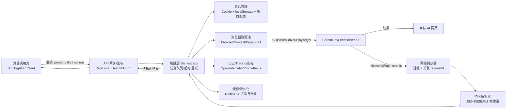

# 使用 Rust 通过无头浏览器或浏览器 CDP 将 AI 网页版封装为可调用 API 的可行方案深度研究报告

## 执行摘要

将“AI 网页版”封装成可调用 API（HTTP/gRPC）总体上**技术可行**：通过无头/有头浏览器自动化实现 DOM 交互（定位输入框、上传文件、点击按钮），并借助 **Chrome DevTools Protocol（CDP）**监听/拦截网络流量，从而提取网页端实际调用的接口与返回结果，再对外包装为服务端 API。CDP 的 Network/Fetch 域提供了请求/响应跟踪、响应体获取、WebSocket 帧事件、SSE 事件等能力，为“抓取真实 API 调用”提供了协议层基础。citeturn24view0turn25view0  
但工程化落地的难点不在“能不能做”，而在“**能不能稳定、合规、可维护**”：目标站点常包含登录态、一次性 token、设备指纹、反机器人策略（验证码/行为识别/风控）以及流式返回（SSE/WebSocket），这些都会导致封装层在不同时间或不同环境出现不稳定。并且，若该封装意在绕过官方 API/付费机制或违反站点条款，会带来显著法律与合规风险（本报告后文会明确提示与约束）。

在 Rust 生态工具选择上：  
- 若优先“**CDP 直连 + 成熟度 + 能快速做端到端 PoC**”，**rust-headless-chrome / headless_chrome**是极具性价比的选择：提供 Tab/Element 高层 API、支持请求拦截与响应体获取，并提供 `Element::set_input_files` 做文件上传。citeturn9view0turn26view0turn26view1turn30view2  
- 若优先“**Playwright 级别的网络与自动等待能力 + 多浏览器**”，Rust 侧较新的 **playwright-rs（padamson/playwright-rust）**近期迭代非常快，已包含路由拦截（Route API）、按 Page 订阅网络事件、connect_over_cdp 等能力，但其文档明确标注“Active Development - Not yet ready for production use”，需要谨慎评估生产可用性。citeturn17view0turn16view0turn16view3turn16view2  
- 若优先“**纯协议客户端（最低抽象）**”，如 **cdpkit** 提供强类型事件流、可直接订阅 `Network.requestWillBeSent` 等事件，但需要自己处理浏览器进程管理与更高层 DOM 操控封装。citeturn12view0turn24view0  
- WebDriver 路线（如 **fantoccini**）跨浏览器更通用，但抓取网络细节（尤其是响应体、WebSocket 帧）通常不如 CDP/Playwright 直达。citeturn11view0turn24view0  

## 目标定义与总体可行性分析

本研究按你提供的目标拆解为一条“从网页交互到协议捕获再到 API 封装”的闭环链路：

### 交互目标与可行性边界

需要实现的浏览器侧能力包括：  
1) **检测并定位交互元素**（输入框、文件上传控件、按钮等）。以 CSS/XPath 为主，必要时补充可访问性树（Accessibility Tree）与脚本评估（evaluate）。Rust 生态中 headless_chrome、fantoccini 等均以 CSS 选择器为主，headless_chrome 同时提供 XPath 定位（`find_element_by_xpath` 等）。citeturn11view0turn23view0turn30view2  
2) **模拟用户操作**：点击、键盘输入、文件上传（`input[type=file]`）、必要时滚动与等待。headless_chrome 的 Element API 提供点击与输入，同时提供 `set_input_files` 用于文件注入。citeturn30view2turn9view0  
3) **捕获并解析网络请求与响应**：这是“提取 AI 服务真实 API 调用”的核心。CDP 的 Network 域提供 `requestWillBeSent`、`responseReceived`、`getRequestPostData`、`getResponseBody` 等能力，并包含 WebSocket 帧事件与 EventSource（SSE）事件。citeturn24view0 Fetch 域则提供 `requestPaused`（可拦截/修改/放行）、`getResponseBody`、`takeResponseBodyAsStream`（以 StreamHandle 形式读取响应体）等能力。citeturn25view0  

可行性边界与现实问题：  
- **multipart/form-data 文件上传**在“抓取请求体”时有天然困难：CDP 的 `Network.getRequestPostData` 文档明确指出其返回“Request body string, omitting files from multipart requests”（会省略 multipart 中的文件内容）。citeturn24view0 因此若你的目标是还原“文件字节”的真实上传载荷，需要结合 Fetch 域在更早阶段拦截、或在服务端侧（你可控的上传代理）补全。citeturn25view0turn24view0  
- **流式响应**常见于 AI 网页（SSE 或 WebSocket）。Network 域包含 `eventSourceMessageReceived`（SSE）与 `webSocketFrameReceived`/`webSocketFrameSent` 等事件，但不同 Rust 封装库对这些事件的支持程度不一（例如 rust-headless-chrome README 明确列出对 SSE/WebSocket 检查能力的缺失项）。citeturn9view0turn24view0  
- **无头/有头模式差异**会影响稳定性。Chrome 官方文档指出 Headless 可在无人值守环境运行，并且自 Chrome 112 起更新无头模式，使其“创建但不显示任何平台窗口”，功能不受限制；但 Chrome/Chromium 的实现也在演进（例如 Chromium 仓库说明“as of M132…旧 headless shell 不再是 Chrome 二进制的一部分，需要迁移到 chrome-headless-shell”）。citeturn35search1turn28search12 这意味着你在 CI/容器中依赖的 Chrome 形态与启动参数需要纳入长期维护计划。

## Rust 库与工具对比

下表按“CDP 直连 / WebDriver / Playwright”三条路线，对你点名的库做对比（以 2026-03-22 为基准；若未指定则标注为“无特定约束”）。

### Rust 自动化与 CDP 库对比表

| 方案/库 | 路线 | 维护状态（证据） | DOM 操作 | 文件上传 | 网络监听/拦截能力 | 无头/有头 | 并发与性能倾向 | 跨平台与浏览器兼容性 | 适用结论 |
|---|---|---|---|---|---|---|---|---|---|
| headless_chrome（rust-headless-chrome） | CDP 高层封装 | GitHub Releases 存在，1.0.21 于 2 月发布；README 强调其为 Puppeteer 等价物，并列出“请求拦截、截图、PDF、headful、自动下载 Chromium”等。citeturn7view0turn9view0turn31search14 | CSS + XPath（Tab/Element 提供 `find_element_by_xpath` 等）citeturn23view0turn30view2 | `Element::set_input_files`；也可拦截文件选择器（Chrome 77+）。citeturn30view2turn26view3 | `enable_request_interception`（基于 Fetch.requestPaused）、`register_response_handling` 可抓响应体。citeturn26view0turn26view1turn32view0turn25view0 | 支持 headless/headful；并可自动下载“known good”Chromium。citeturn9view0turn31search14 | 同步 API（线程驱动）；适合用线程池/进程池做并发隔离。其 README 也对比了 fantoccini 的 Tokio 异步。citeturn31search18turn11view0 | 以 Chromium 为主；跨平台依赖 Chromium/Chrome 安装或 fetch。citeturn9view0turn31search14 | **推荐做 PoC/中短期落地**：能快速打通“DOM→上传→点击→抓包→回传 JSON”。对流式/WS 与高反爬站点需额外工程投入。citeturn9view0turn24view0 |
| chromiumoxide | CDP 高层封装（async） | README 描述“高层 async API、支持所有 CDP、可 headless/headful、Page::execute 发送任意 Command”；但 GitHub releases 页显示“没有 Releases”，docs.rs 显示 crate 版本较旧，且曾有“CDP 新方法导致反序列化失败”类问题。citeturn10view1turn5search0turn5search15turn5search11 | CSS 查找 + Page::execute 自定义命令citeturn10view1 | 可通过 CDP DOM.setFileInputFiles 等命令实现（需自行封装）。citeturn2search9turn10view1 | 理论上可订阅全部 CDP 事件；但协议版本与生成代码的匹配是维护重点。citeturn10view1turn5search11turn24view0 | headless/headful；fetcher 可自动下载 Chromium。citeturn10view1 | Tokio 异步（仅支持 Tokio）。citeturn10view1 | Chromium；跨平台取决于 Chromium 可用性。citeturn10view1 | **适合想要 async + CDP 全量控制的人**，但“发布节奏/协议同步”风险需要你自行兜底。citeturn5search11turn5search0 |
| cdpkit | 纯 CDP 客户端（强类型、事件流） | README 标注“强类型、tokio、事件流、多路复用、从官方 CDP 规范生成、可更新绑定”；并显示 v0.2.2（2026-03-03）。citeturn12view0 | 需要自己基于 DOM/Runtime/Page 等域封装更高层 DOM 操作citeturn12view0turn24view0 | 可用 DOM.setFileInputFiles（需自己定位 nodeId/backendNodeId/objectId）。citeturn2search9turn12view0 | 事件流订阅非常适合网络抓包（如 `Network.requestWillBeSent`、`webSocketFrameReceived` 等）。citeturn12view0turn24view0 | 依赖外部启动浏览器（远程调试端口）citeturn12view0 | async/await + stream，适合高并发抓取与自定义调度citeturn12view0 | Chromium/Chrome（CDP）；跨平台取决于浏览器部署citeturn12view0turn35search1 | **适合做“协议级网关/抓包”核心**，但需要你补齐浏览器进程管理与 DOM 自动化层。citeturn12view0 |
| cdp-rs（btbaggin/cdp-rs，crate: cdp-rs 0.3.3） | 纯 CDP 客户端（较老） | docs.rs 显示 0.3.3 发布于 2023-01-08，使用前需自行启动 Chrome 并开启 remote-debugging-port。citeturn14view0 | 需要自己封装 DOM 操作citeturn14view0turn24view0 | 可用 DOM.setFileInputFiles（自行实现）citeturn2search9turn14view0 | 可发送/接收 CDP 消息；但工程化能力需自己补齐citeturn14view0turn24view0 | 依赖外部 Chrome 实例citeturn14view0 | 同步/阻塞式风格（按其示例）citeturn14view0 | Chromium/Chrome；跨平台由浏览器决定citeturn14view0 | **仅建议用于学习/小工具**；生产建议优先 cdpkit 或更活跃项目。citeturn14view0turn12view0 |
| oh0123/cdp-rs（实际 crate 为 cdp-core） | CDP 高层封装（新） | README 列出“Browser 控制、元素交互、网络拦截/监控/修改、存储管理、可访问性树、性能追踪”等；并有 Release（v0.2.0，2025-12-13）。citeturn13view0 | 高层 `Page.query_selector` 等；宣称支持跨 iframe 查询与 Shadow Root。citeturn13view0 | 未在摘录中给出具体 API，但基于 CDP 可实现 input file 注入citeturn13view0turn2search9 | 网络拦截/监控/修改（Feature 列表明确写出）。citeturn13view0 | Chromium/Chrome；Tokiociteturn13view0 | async 适合做服务端调度citeturn13view0 | 新项目，生态与稳定性需实测citeturn13view0 | **值得关注的“Rust 原生 Playwright 替代”方向**，但需要你用压测与回归验证其完备性。citeturn13view0 |
| playwright-rs（padamson/playwright-rust，crate: playwright-rs） | Playwright Rust 绑定（Node server 架构） | docs.rs 显示 0.8.6（2026-03-14）；文档明确“Active Development - Not yet ready for production use”；同时解释其通过 Node.js Playwright Server（JSON-RPC over stdio）实现多浏览器支持。citeturn17view0 | Playwright 风格 locator（含 get_by_*）；自动等待能力强citeturn17view0turn16view2 | Playwright 体系通常对文件上传支持完善（需按其 API）；但这里更建议以其官方能力为准citeturn17view0 | Release notes 显示：Complete Route API（网络拦截）、page.on_request/on_response 等网络事件订阅、connect_over_cdp（含 browserless）。citeturn16view0turn16view3turn16view2 | 支持 Chromium/Firefox/WebKit；需安装匹配浏览器版本（文档给出 npx playwright@版本 install）。citeturn17view0 | async/await；适合高并发服务端，但依赖 Node driver 与浏览器安装流程citeturn17view0 | 跨平台（文档标注 Windows/macOS/Linux）citeturn17view0 | **中长期推荐**：若其稳定性达标，将是“Rust 服务端封装网页自动化”的强解；短期需谨慎上生产。citeturn17view0turn16view0 |
| playwright（octaltree/playwright-rust，crate: playwright 0.0.20） | Playwright Rust port（旧） | README 显示 crate 版本 0.0.20；GitHub releases 显示“没有 releases”；且 issues 中曾出现“Network.webSocketFrameReceived 不支持”的反馈。citeturn18view1turn18view2turn4search24 | 基础 page.goto/click/eval 等citeturn18view1 | 取决于实现完善度（需实测）citeturn18view1 | 网络能力不如新一代实现透明（且 WS 相关支持存疑）citeturn4search24turn24view0 | 依赖 Node driver（README 说明）citeturn18view1 | 多 runtime（tokio/async-std/actix-rt）citeturn18view1 | 跨平台取决于 Playwright driverciteturn18view1 | **不建议作为主力选型**，除非你锁定其版本并能接受功能缺口。citeturn18view2turn4search24 |
| fantoccini | WebDriver（跨浏览器） | GitHub 项目成熟（WebDriver 高层 API），README 明确基于 W3C WebDriver，通过 CSS selector 驱动，并需要 geckodriver/chromedriver 等进程。citeturn11view0 | CSS 强、表单封装（Client::form）citeturn11view0 | WebDriver 对 input[type=file] 通常是“send keys 路径”的哲学（更偏测试）citeturn11view0turn27search9 | WebDriver 不等同 CDP：抓包/响应体/WS 帧通常需要额外手段citeturn11view0turn24view0 | 支持 headless 浏览器（由具体 driver 决定）citeturn11view0 | Tokio 异步；适合并发调度，但网络细节受限citeturn11view0 | 跨浏览器（Chrome/Firefox 等，取决于 driver）citeturn11view0 | **适合“稳定的 UI 自动化测试/通用爬取”**；若你以“提取真实 API 调用”为主，CDP/Playwright 更直接。citeturn24view0turn25view0 |
| puppeteer-rs（eric-pigeon/puppeteer-rs） | 不成熟封装 | 仓库 star 很少、README 基本为空、无 releases，整体不适合选型。citeturn21view0turn22view2 | 不明确 | 不明确 | 不明确 | 不明确 | 不明确 | 不明确 | **不推荐**（研究价值有限）。citeturn21view0turn22view2 |

## 实现方法详解

本节给出一套“通用实现路线”，并在关键点标注协议与库层实现方式。你未指定目标站点与反爬强度，故对“验证码/反机器人”为**无特定约束**，但会明确合规边界。

### 基于 CDP 的网络监听与拦截

#### 捕获 fetch/XHR/普通 HTTP 请求

CDP 的 **Network** 域是“观测面”，其定义了：  
- `Network.requestWillBeSent`、`Network.responseReceived`、`Network.loadingFinished` 等事件，用于跟踪请求生命周期；  
- `Network.getRequestPostData`（获取请求体，注意对 multipart 文件会省略文件内容）；  
- `Network.getResponseBody`（获取响应体）。citeturn24view0  

对抓取 AI 网页实际 API 调用而言，常见过滤策略：  
- 按 **URL host/path**（例如 `/api/*`、`/backend/*`、GraphQL endpoint 等）；  
- 按 **method**（POST 多于 GET）；  
- 按 **Content-Type / Accept**（JSON、SSE 的 `text/event-stream`）；  
- 按 **请求体特征**（例如包含 “prompt”、“messages”、“model” 等字段）；  
- 按 **发起方**（frameId、initiator、resourceType）。这些字段在 CDP 的事件/类型中是可得的，但不同 Rust 封装库暴露程度不同。citeturn24view0turn25view0  

#### 拦截与修改请求（含抓取更完整的请求信息）

对“封装为 API”的场景，通常需要“可控面”：能够在请求发出前拦截、改写 headers/body、阻断资源、或注入代理逻辑。CDP 的 **Fetch** 域就是为此设计：  
- `Fetch.enable` 会产生 `requestPaused` 事件，请求会暂停，直到你 `continueRequest / fulfillRequest / failRequest`；  
- `requestPaused` 事件里包含 request 详情（类型为 `Network.Request`）；  
- 在 Response 阶段还能 `Fetch.getResponseBody`，或用 `Fetch.takeResponseBodyAsStream` 以流的方式读取响应体句柄。citeturn25view0turn24view0  

在 rust-headless-chrome 中，这条路径被包装为：  
- `Tab.enable_request_interception(...)`：允许检查 outgoing requests 并决定如何处理。citeturn26view0turn34view0  
- 其拦截回调拿到的 event 类型就是 `RequestPausedEvent`（对应 Fetch.requestPaused），其 params 内含 `request_id` 与 `request` 等信息。citeturn34view0turn37view0  

#### WebSocket 与 SSE（流式返回）

AI 网页端常见两类流式：  
- **SSE（EventSource）**：Network 域提供 `Network.eventSourceMessageReceived` 事件；citeturn24view0  
- **WebSocket**：Network 域提供 `Network.webSocketFrameReceived / webSocketFrameSent` 等事件。citeturn24view0  

现实差异在于：协议层“有能力”，但库层是否完整暴露。rust-headless-chrome README 明确把 SSE/WebSocket inspection 列为缺失能力之一（这意味着你可能需要直接订阅底层事件或换用更贴近 CDP 的库）。citeturn9view0turn24view0 旧版 octaltree/playwright-rust 也曾出现“webSocketFrameReceived 未实现”的反馈。citeturn4search24  

#### multipart/form-data 上传载荷的捕获限制

如前所述，`Network.getRequestPostData` 对 multipart 会“省略文件内容”。citeturn24view0 因此在“上传文件 + 抓取完整请求体”的目标下，你需要接受三种工程策略之一：  
- 只抓取**文本字段与元数据**（Content-Type、boundary、filename、size 等）；  
- 把上传动作移到你可控服务端（例如：浏览器只负责拿到 token/签名，你的后端走正式上传接口）；  
- 在 Fetch 域做更深的拦截与转发（复杂度更高，且常触及合规/条款红线）。citeturn25view0turn24view0  

### DOM 元素定位策略

#### CSS/XPath 与“可维护选择器”

在 Rust 生态里，CSS selector 是主流：fantoccini 明确说明“Most interactions are driven by using CSS selectors”。citeturn11view0 rust-headless-chrome 同时暴露 XPath（`find_element_by_xpath` 等）。citeturn23view0turn30view2  

对于封装 AI 网页这种**高动态 DOM**页面，建议优先级如下：  
- 先用稳定属性：`data-testid`、`aria-label`、`placeholder`、`role` 等（Playwright 系列特别强调 get_by_* 与 role 定位）。citeturn16view2turn17view0  
- 再用结构 CSS（尽量短、避免层级过深），并配合“等待可见/可交互”。rust-headless-chrome releases 中就有“wait until element is visible”的更新记录，体现其对稳定性交互的关注。citeturn7view0  
- 必要时用 XPath 作为补充（适合按文本或结构定位，但可维护性一般更差）。citeturn30view2  

#### 可视化定位与基于 ML 的识别（可行性评估）

- **可视化定位**（截图 + 人工标注/回归测试）适合做“回归保障”，不适合做“纯自动识别”。rust-headless-chrome 提供页面与元素截图能力。citeturn9view0turn30view2  
- **基于 ML 的识别**（视觉模型识别按钮/输入框位置）在技术上可行，但会引入模型推理延迟、误检、以及更复杂的工程链路；通常只在“DOM 高度混淆、语义属性缺失、且业务价值足够高”的场景才值得做（本报告按通用场景，不作为首选方案）。

### 文件上传模拟

对于 `<input type="file">`，CDP 推荐的底层方法是 `DOM.setFileInputFiles`。citeturn2search9 在 rust-headless-chrome 中，Element 层已提供 `set_input_files`，可直接把本地路径注入到 file input。citeturn30view2  

若页面使用“点击按钮弹原生文件选择器”，rust-headless-chrome 也支持拦截文件选择器：`set_file_chooser_dialog_interception` 并用 `handle_file_chooser` 注入文件；文档注明该能力仅对 Chromium/Chrome 77+ 有效。citeturn26view3  

### 验证码与反机器人（无特定约束）

由于你未指定站点与强度，本报告仅给出**合规与工程可行**的方向性建议：  
- 首选与站点协商或使用站点提供的官方 API/SDK。  
- 对必须登录/验证码的页面，建议支持“人工协助/一次性登录后复用会话”（例如导入 cookie/localStorage），而不是尝试绕过。  
- 工程上把“验证码出现”当作可观测事件：触发告警、降级（返回可解释错误）、或进入人工流程。  
- 不建议提供或实现绕过验证码/风控的具体技巧；这往往违反服务条款并可能触法。

## 设计架构与工程化建议

### 推荐的组件化架构与请求流

下面给出一个通用、可扩展的服务端架构（HTTP/gRPC 均可），重点体现：会话管理、浏览器资源池、CDP 抓包解析、以及对外 API。



关键工程点与对应工具能力映射：  
- **会话与存储**：rust-headless-chrome 的 Tab API 暴露了 cookies 与 storage 相关方法（如 `get_cookies`、`set_cookies`、`get_storage`、`set_storage` 等），便于复用登录态并减少重复登录成本。citeturn23view0turn26view0  
- **网络捕获与关联**：CDP Network/Fetch 域提供从事件到响应体的完整链路（含 `getResponseBody`、WebSocket 帧事件、SSE 事件）。citeturn24view0turn25view0  
- **远程 CDP 与集群化**：playwright-rs 的 release notes 显示其 `connect_over_cdp` 支持 browserless、`--remote-debugging-port` 等 CDP 服务，可用来把浏览器以独立节点部署，实现水平扩展。citeturn16view2  

### 单机/多进程/集群方案建议表

| 部署形态 | 适用规模 | 优点 | 典型瓶颈 | 推荐做法 |
|---|---|---|---|---|
| 单机单进程（同进程内起浏览器） | PoC/低流量 | 最简单；调试快 | 浏览器进程数量与内存/CPU 竞争；单点故障 | 把“浏览器任务”放入受控线程池；设置全局超时；把日志与 HAR/抓包落盘以便复现 |
| 单机多进程（worker 模型） | 中等流量 | 进程级隔离更强；崩溃不影响全局 | 进程通信与调度复杂 | 建议“API Gateway + Worker Pool”；Worker 内维护浏览器池；会话信息用 Redis/DB 共享 |
| 集群（浏览器节点独立部署） | 高并发/高稳定性要求 | 可水平扩展；浏览器/业务解耦 | 节点编排、网络延迟、会话迁移复杂 | 用 remote CDP 或 Playwright connect_over_cdp；将会话固定到节点（sticky session）；统一指标与追踪 |

### 并发与资源隔离实践

- **浏览器实例池 vs 页面复用**：为了降低启动成本，通常复用 Browser 进程，按请求创建 incognito context 或新 page，以隔离 cookie/storage。Playwright 架构天然支持 context；CDP 直连也可通过 Target/BrowserContext 等域实现，但封装库暴露程度不同。citeturn17view0turn24view0  
- **限流与排队**：对外 API 必须有 Rate Limit；否则会迅速把浏览器节点打满（CPU、文件句柄、共享内存）。  
- **故障恢复**：浏览器崩溃和页面卡死是常态；需要 watchdog（超时强杀进程、重建 Browser、重放任务）。这也是为什么 chromiumoxide 这类“协议与版本匹配问题”会放大维护成本（协议反序列化失败会直接造成任务失败）。citeturn5search11turn10view1  

## 端到端示例工程

下面给出一个**可运行的最小端到端示例**：  
- 本机启动一个 Axum 服务，提供：  
  - `/demo`：一个“模拟 AI 网页”的页面（含输入框、文件上传、按钮）；  
  - `/mock_ai`：模拟 AI 后端接口，接收 multipart 并返回 JSON；  
  - `/api/submit`：你的“封装 API”，调用 headless_chrome 自动操作 `/demo`，并通过 CDP **拦截请求与抓取响应体**，最终把识别到的“目标 API 请求/响应”以 JSON 返回。  
- 示例重点展示：  
  - 元素定位（CSS）  
  - 文件上传（`Element::set_input_files`）citeturn30view2  
  - CDP 请求拦截（Fetch.requestPaused：`Tab.enable_request_interception`）citeturn26view0turn34view0turn37view0  
  - CDP 响应体抓取（`Tab.register_response_handling` + `fetch_body()`）citeturn26view1turn32view0  
  - 识别目标 API（按 URL + method）并封装返回

> 说明：示例中的“目标 AI 请求”是 `/mock_ai`（同域），便于稳定复现。迁移到真实 AI 网页时，你需要把过滤规则换成真实 endpoint（host/path），并处理鉴权 token、SSE/WS 流式等差异。CDP 在协议层支持 WS/SSE 事件，但库层是否完整暴露需按选型评估。citeturn24view0turn9view0  

### Cargo.toml 依赖清单（示例）

```toml
[package]
name = "ai_web_wrapper_demo"
version = "0.1.0"
edition = "2024"

[dependencies]
axum = "0.8"
tokio = { version = "1", features = ["rt-multi-thread", "macros"] }
serde = { version = "1", features = ["derive"] }
serde_json = "1"
tracing = "0.1"
tracing-subscriber = "0.3"
base64 = "0.22"

# CDP/浏览器自动化
headless_chrome = "1.0"
```

> headless_chrome 具备“自动下载 Chromium（二进制 known good）”能力（可用 feature fetch / 或按其文档方式），能降低 CI/容器环境部署成本。citeturn9view0turn31search14  

### main.rs 完整代码示例

```rust
use axum::{
    extract::{Multipart, State},
    http::StatusCode,
    response::{Html, IntoResponse},
    routing::{get, post},
    Json, Router,
};
use headless_chrome::{Browser, LaunchOptions};
use serde::{Deserialize, Serialize};
use serde_json::json;
use std::{
    path::PathBuf,
    sync::{Arc, Mutex},
    time::{Duration, Instant},
};
use tokio::task;
use tracing::{error, info};

#[derive(Clone)]
struct AppState {
    base_url: String, // 例如 http://127.0.0.1:3000
}

#[derive(Debug, Deserialize)]
struct SubmitReq {
    prompt: String,
    /// 服务器本地文件路径（示例为了简单直接用本地路径；生产场景可改为上传到你的 API）
    file_path: String,
    /// 可选：超时（毫秒）
    timeout_ms: Option<u64>,
}

#[derive(Debug, Serialize, Default, Clone)]
struct CapturedNet {
    // 识别出来的“目标 API 请求”
    url: Option<String>,
    method: Option<String>,
    headers: Option<serde_json::Value>,
    post_data: Option<String>, // multipart 场景可能不完整；真实情况请结合 CDP 限制处理
    // 对应响应
    status: Option<i64>,
    response_body: Option<serde_json::Value>,
}

#[tokio::main]
async fn main() {
    tracing_subscriber::fmt().with_target(false).init();

    let state = AppState { base_url: "http://127.0.0.1:3000".to_string() };

    let app = Router::new()
        .route("/demo", get(demo_page))
        .route("/mock_ai", post(mock_ai))
        .route("/api/submit", post(api_submit))
        .with_state(state);

    let listener = tokio::net::TcpListener::bind("127.0.0.1:3000").await.unwrap();
    info!("listening on {}", listener.local_addr().unwrap());
    axum::serve(listener, app).await.unwrap();
}

async fn demo_page() -> Html<&'static str> {
    // 一个“模拟 AI 网页”：输入框 + 文件上传 + 发送按钮
    // 点击后用 fetch(FormData) POST 到 /mock_ai，并把 JSON 回显到页面。
    Html(r#"<!doctype html>
<html>
<head><meta charset="utf-8"><title>Mock AI Web</title></head>
<body>
  <h2>Mock AI Web</h2>
  <label>Prompt</label><br/>
  <textarea id="prompt" rows="4" cols="60" placeholder="Type here..."></textarea><br/><br/>
  <label>File</label>
  <input id="file" type="file"/><br/><br/>
  <button id="send">Send</button>
  <pre id="out"></pre>

<script>
document.getElementById('send').addEventListener('click', async () => {
  const fd = new FormData();
  fd.append('prompt', document.getElementById('prompt').value);
  const f = document.getElementById('file').files[0];
  if (f) fd.append('file', f, f.name);

  const resp = await fetch('/mock_ai', { method: 'POST', body: fd });
  const data = await resp.json();
  document.getElementById('out').textContent = JSON.stringify(data, null, 2);
});
</script>
</body>
</html>"#)
}

async fn mock_ai(State(_state): State<AppState>, mut multipart: Multipart) -> impl IntoResponse {
    // 模拟 AI 后端：接收 prompt 与 file，并返回 JSON
    let mut prompt: Option<String> = None;
    let mut filename: Option<String> = None;
    let mut file_size: Option<usize> = None;

    while let Ok(Some(field)) = multipart.next_field().await {
        let name = field.name().unwrap_or("").to_string();
        if name == "prompt" {
            prompt = field.text().await.ok();
        } else if name == "file" {
            filename = field.file_name().map(|s| s.to_string());
            // 仅统计大小，不保存（示例用）
            if let Ok(bytes) = field.bytes().await {
                file_size = Some(bytes.len());
            }
        }
    }

    let reply = format!(
        "Echo: prompt_len={}, filename={:?}, file_size={:?}",
        prompt.as_deref().unwrap_or("").len(),
        filename,
        file_size
    );

    (StatusCode::OK, Json(json!({
        "ok": true,
        "reply": reply,
        "prompt": prompt,
        "filename": filename,
        "file_size": file_size
    })))
}

async fn api_submit(
    State(state): State<AppState>,
    Json(req): Json<SubmitReq>,
) -> impl IntoResponse {
    let timeout = Duration::from_millis(req.timeout_ms.unwrap_or(10_000));

    // 共享捕获结果：拦截器（请求）与响应处理器（响应体）会写入这里
    let captured = Arc::new(Mutex::new(CapturedNet::default()));

    let base = state.base_url.clone();
    let captured_clone = captured.clone();
    let prompt = req.prompt.clone();
    let file_path = req.file_path.clone();

    // headless_chrome 是同步 API，放到 spawn_blocking 里避免阻塞 Tokio worker
    let run = task::spawn_blocking(move || {
        run_browser_flow(&base, &prompt, &file_path, captured_clone, timeout)
    }).await;

    match run {
        Ok(Ok(())) => {
            let out = captured.lock().unwrap().clone();
            (StatusCode::OK, Json(out)).into_response()
        }
        Ok(Err(e)) => {
            error!("browser flow error: {}", e);
            (StatusCode::BAD_GATEWAY, Json(json!({"ok": false, "error": e}))).into_response()
        }
        Err(e) => {
            error!("join error: {}", e);
            (StatusCode::INTERNAL_SERVER_ERROR, Json(json!({"ok": false, "error": e.to_string()}))).into_response()
        }
    }
}

fn run_browser_flow(
    base_url: &str,
    prompt: &str,
    file_path: &str,
    captured: Arc<Mutex<CapturedNet>>,
    timeout: Duration,
) -> Result<(), String> {
    // 生产建议：显式配置 chrome 路径、代理、用户数据目录、超时、以及是否 headful
    let browser = Browser::new(
        LaunchOptions::default_builder()
            .headless(true)
            .build()
            .map_err(|e| format!("LaunchOptions build failed: {e}"))?
    ).map_err(|e| format!("Browser launch failed: {e}"))?;

    let tab = browser.new_tab().map_err(|e| format!("new_tab failed: {e}"))?;

    // 1) 开启“请求拦截”：基于 Fetch.requestPaused
    // 捕获 method/url/headers/postData，并放行请求继续执行
    {
        let captured_req = captured.clone();
        tab.enable_request_interception(Arc::new(move |_transport, _session_id, event| {
            // event: RequestPausedEvent（Fetch.requestPaused）
            // params 内含 request_id / request(Network.Request) 等字段
            let req_val = serde_json::to_value(&event.params.request).unwrap_or(json!({}));

            let url = req_val.get("url").and_then(|v| v.as_str()).unwrap_or("").to_string();
            let method = req_val.get("method").and_then(|v| v.as_str()).unwrap_or("").to_string();
            let headers = req_val.get("headers").cloned();
            let post_data = req_val.get("postData").and_then(|v| v.as_str()).map(|s| s.to_string());

            // 识别“目标 API 请求”：示例按 URL 路径 + method
            if url.contains("/mock_ai") && method == "POST" {
                let mut cap = captured_req.lock().unwrap();
                cap.url = Some(url);
                cap.method = Some(method);
                cap.headers = headers;
                cap.post_data = post_data;
            }

            // 放行继续（不修改请求）
            headless_chrome::browser::tab::RequestPausedDecision::Continue(None)
        })).map_err(|e| format!("enable_request_interception failed: {e}"))?;
    }

    // 2) 注册“响应处理”：抓到响应后可调用 fetch_body() 获取响应体
    // ResponseHandler 的签名是 (ResponseReceivedEventParams, &dyn Fn() -> Result<GetResponseBodyReturnObject, Error>)
    // 见 docs.rs 类型别名说明。
    {
        let captured_resp = captured.clone();
        tab.register_response_handling("cap_resp", Box::new(move |resp, fetch_body| {
            let url = resp.params.response.url.clone();
            if url.contains("/mock_ai") {
                let status = resp.params.response.status as i64;
                let body_obj = fetch_body();
                if let Ok(body_obj) = body_obj {
                    // body_obj.body 通常是字符串；若 base64Encoded 则需解码
                    let body_text = if body_obj.base64_encoded {
                        base64::decode(body_obj.body).ok()
                            .and_then(|b| String::from_utf8(b).ok())
                            .unwrap_or_else(|| "".to_string())
                    } else {
                        body_obj.body
                    };

                    let body_json = serde_json::from_str::<serde_json::Value>(&body_text).ok();

                    let mut cap = captured_resp.lock().unwrap();
                    cap.status = Some(status);
                    cap.response_body = body_json;
                }
            }
        })).map_err(|e| format!("register_response_handling failed: {e}"))?;
    }

    // 3) 打开页面并做 DOM 自动化
    let demo_url = format!("{}/demo", base_url);
    tab.navigate_to(&demo_url)
        .map_err(|e| format!("navigate_to failed: {e}"))?
        .wait_until_navigated()
        .map_err(|e| format!("wait_until_navigated failed: {e}"))?;

    // 定位输入框并输入
    tab.wait_for_element("#prompt")
        .map_err(|e| format!("cannot find prompt textarea: {e}"))?
        .click()
        .map_err(|e| format!("click prompt failed: {e}"))?
        .type_into(prompt)
        .map_err(|e| format!("type_into failed: {e}"))?;

    // 文件上传：把本地文件路径注入到 <input type=file>
    let file = PathBuf::from(file_path);
    if !file.exists() {
        return Err(format!("file not found: {}", file.display()));
    }
    tab.wait_for_element("#file")
        .map_err(|e| format!("cannot find file input: {e}"))?
        .set_input_files(vec![file.display().to_string()])
        .map_err(|e| format!("set_input_files failed: {e}"))?;

    // 点击发送按钮触发 fetch(/mock_ai)
    tab.wait_for_element("#send")
        .map_err(|e| format!("cannot find send button: {e}"))?
        .click()
        .map_err(|e| format!("click send failed: {e}"))?;

    // 4) 等待捕获完成
    let start = Instant::now();
    loop {
        {
            let cap = captured.lock().unwrap();
            if cap.url.is_some() && cap.status.is_some() && cap.response_body.is_some() {
                break;
            }
        }
        if start.elapsed() > timeout {
            return Err("timeout waiting for captured request/response".to_string());
        }
        std::thread::sleep(Duration::from_millis(50));
    }

    Ok(())
}
```

### 运行步骤与注意事项

1) 启动服务：  
```bash
cargo run
```

2) 准备一个要上传的文件（例如 `/tmp/demo.txt` 或 Windows 路径）。  

3) 调用封装 API：  
```bash
curl -X POST http://127.0.0.1:3000/api/submit \
  -H "content-type: application/json" \
  -d '{"prompt":"你好，帮我总结一下文件内容","file_path":"/tmp/demo.txt","timeout_ms":10000}'
```

4) 你会得到类似输出（示意）：  
- `url/method/headers/post_data`：来自 **Fetch.requestPaused** 拦截（示例过滤 `/mock_ai` + POST）；citeturn25view0turn34view0turn37view0  
- `status/response_body`：来自 **ResponseReceived + fetch_body()** 抓到的响应体解析。citeturn32view0turn26view1turn24view0  

注意事项（与真实 AI 网页迁移相关）：  
- 若真实站点响应是 SSE/WS 流式，你需要改为订阅 `Network.eventSourceMessageReceived` 或 `Network.webSocketFrameReceived` 等事件，并做“帧/事件拼装”。citeturn24view0  
- 若真实站点上传走 multipart，`post_data` 很可能不包含文件字节（CDP 有省略行为）；需要重新设计上传链路。citeturn24view0  
- 若你发现 `register_response_handling` 在复杂解析时不稳定，可参考社区 issue（例如有人反馈在 ResponseHandler 内做 serde_json 处理会异常），建议把重计算移到 handler 外部或做更强隔离。citeturn31search5  

## 安全、合规与反爬对策

### 服务端 API 安全基线

对外封装为 HTTP/gRPC 服务时，必须视其为“高价值接口”，至少包含：  
- 鉴权（API Key / JWT / mTLS），以及细粒度授权（tenant/用户维度）；  
- 速率限制与配额（避免浏览器资源耗尽导致拒绝服务）；  
- 审计日志（记录调用方、目标站点、关键参数、响应摘要），并做好敏感信息脱敏。  

### 合规与法律风险提示（无特定约束）

将第三方 AI 网页“封装成可调用 API”可能触及：  
- 目标站点服务条款（ToS）对自动化访问、逆向接口、批量调用、转售/转用的限制；  
- 用户隐私与数据合规（prompt、上传文件可能包含个人信息或商业机密）；  
- 安全风控（被识别为机器人流量后封号、IP 拉黑、或触发更严验证）。  

本报告建议：**优先使用目标 AI 官方 API/授权渠道**。若确因内部集成需要进行网页自动化，应取得明确授权，并将封装服务限制在合规用途与受控范围内。

### 反爬与稳定性策略（不提供绕过细节）

可以做的“合规稳定性”措施包括：  
- 采用“会话复用 + 人工一次性登录”方式减少登录频率（cookie/storage 复用）；rust-headless-chrome 的 Tab 暴露了存储与 cookie 能力，适合做会话复用。citeturn23view0turn26view0  
- 失败可解释：把“验证码出现/要求二次验证/网络被阻断”当作业务错误返回，并记录现场证据（截图、抓包摘要）。  
- 将浏览器节点隔离部署，降低被封禁后对整体服务的冲击（Playwright connect_over_cdp 可连接远程 CDP，如 browserless）。citeturn16view2  

## 风险、限制与实施建议

### 主要风险与限制清单

稳定性与维护成本：  
- **协议与版本漂移**：CDP 与 Chromium 版本升级会引入字段/事件变化，导致反序列化或功能缺失。chromiumoxide 就出现过“新方法/事件导致 serde 反序列化失败”的类问题反馈。citeturn5search11turn10view1  
- **库能力缺口**：即便 CDP 在协议层支持 WS/SSE，库层可能未完整实现或未暴露（rust-headless-chrome README 将 SSE/WS inspection 列为缺失项；旧 Playwright Rust port 有 WS 事件未实现反馈）。citeturn9view0turn4search24turn24view0  
- **响应处理器不稳定**：社区 issue 显示在 ResponseHandler 回调内做复杂解析可能出现不一致行为，需要任务隔离与更稳健的处理管道。citeturn31search5  

反爬与业务连续性：  
- 目标站点升级风控策略会导致“昨天可用、今天不可用”；且这类问题往往只能通过持续对抗或获得授权解决。  

隐私与法律：  
- 如果你在未授权下把网页服务“再封装”为可调用 API，风险往往高于一般爬虫，尤其涉及账号、付费能力、或第三方内容再分发。  

### 实施建议与难度分级

结合通用场景，我建议按三阶段推进：

| 阶段 | 目标 | 交付物 | 预估时间 | 难度 |
|---|---|---|---|---|
| PoC（可用性验证） | 打通“输入/上传/点击 + 抓包 + 返回 JSON”闭环 | 单站点 PoC；关键 endpoint 识别规则；最小封装 API | 3–7 天 | 中 |
| 工程化（可运营） | 会话管理、浏览器池、限流、监控、失败可解释 | Browser/Context 池；会话存储；指标与日志；回归脚本 | 2–6 周 | 中-高 |
| 高反爬/高并发（生产级） | 规模化与长期稳定 | 集群部署；节点隔离；灰度与回滚；合规审计 | 1–3 个月+ | 高 |

选型建议（务实版本）：  
- **最快落地**：headless_chrome 做 PoC 与中小规模服务（配合进程/线程池隔离）。citeturn26view0turn26view1turn30view2  
- **中长期演进**：持续关注 playwright-rs（padamson）成熟度；其已具备网络拦截与事件监听等关键能力，并支持 connect_over_cdp 做远程浏览器扩展，但当前仍标注未达到生产就绪。citeturn17view0turn16view0turn16view2  
- **底层可控核心**：用 cdpkit 做“协议捕获与事件流”核心模块，自研上层 DOM 操作与会话/资源池；适合对可控性与可维护性有极高要求的团队。citeturn12view0turn24view0  

如果你后续愿意补充“目标 AI 网页站点（或至少其流式协议形态：SSE/WS）与登录方式”，我可以在不触及绕过风控的前提下，把“网络过滤与事件拼装（SSE/WS）”“会话复用策略”“以及更贴近生产的浏览器池模型”进一步细化到可直接落地的工程设计。